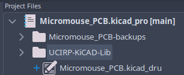
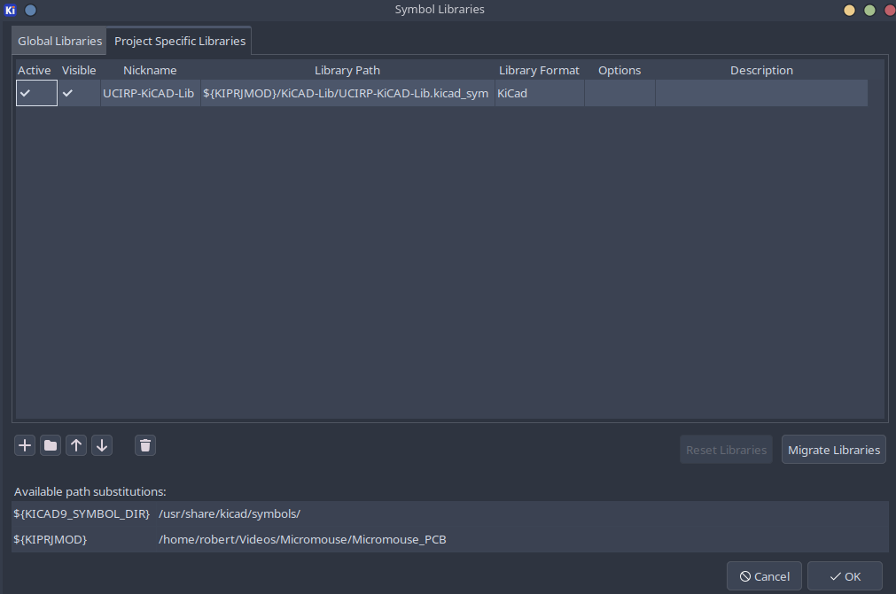
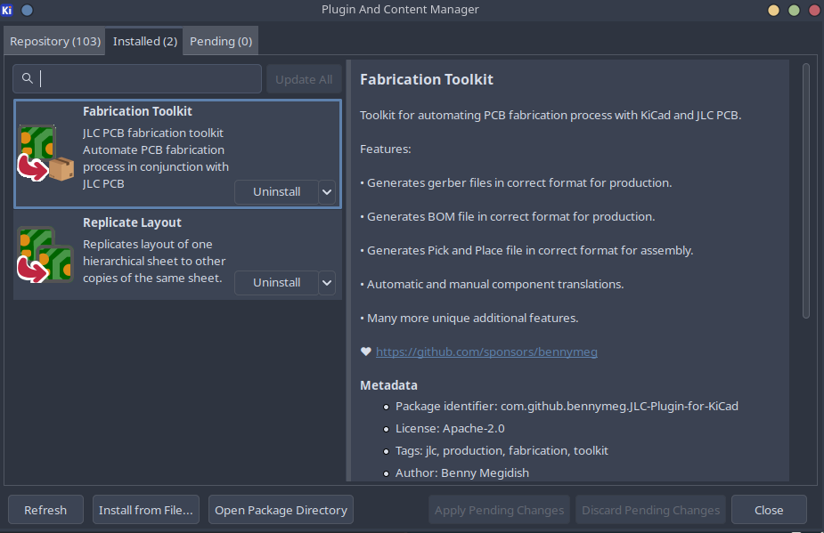
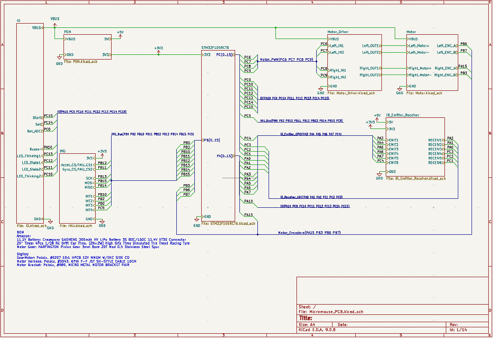
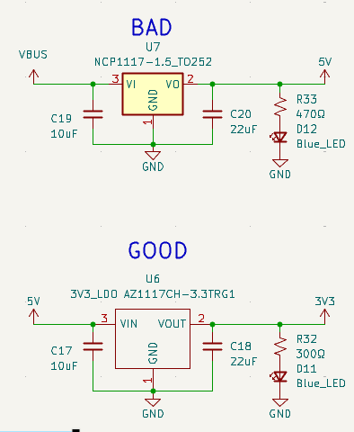

# **Hardware setup and constribution guidelines**
UCI Rocket Project (Liquids) uses the most up-to-date version of **KiCAD** for our PCBAs. Additionally, we use **JLCPCB** as our main fabrication house and assembler for our PCBAs.

This will be a guide on how to setup a KiCAD project for the team and also some guidelines for the schematic capture.

## **Starting a KiCad Project**

All of our hardware projects are version-controlled using GitHub. To get a new board started, follow these steps:

1. **Create the Repository:** Create a new repository in our GitHub organization using the standard naming convention: `rocket#-name-hardware` (for example, `rocket2-ecu-hardware`).
2. **Clone First:** Before touching KiCad, clone the empty repository to your local machine:
   `git clone <repository-link>`

> ⚠️ **WARNING: REPOSITORY INITIALIZATION**
> 
> Always start with `git clone`. **Do not** run `git init` locally. 
> 
> **Note:** We strictly use `main` instead of `master` as our primary branch. Seriously, please do not push a `master` branch!

## **Setting up a KiCAD / a KiCAD project**
---
### **KiCAD projects imports/setup**
There are 2 imports required before starting your board:

* Custom Layout Constraints File (`.kicad_dru`) 
* UCIRP's Component Library (`UCI-KiCAD-Lib`)

  
   
  <em>Figure 1: Required project file/folder</em>

#### Custom Layout Constraints File
The Custom Layout Rules are directly from JLCPCB's design tolerances for a standard PCB.
The .kicad_DRU file can be found here: [JLCPCB.kicad_dru](hardware/KiCad-DesignRules/JLCPCB/JLCPCB.kicad_dru)

Copy this file into your KiCAD project and rename the name of the file to: `"your_project_name".kicad_dru`

The KiCAD project will not detect the custom constraint file unless it has the same name the project.

#### UCIRP's component library
Avionics has created its own custom hardware library for KiCAD with some of the components we assemble onto our boards. To add our KiCAD libary, run the following command while in you project's directory.

`git submodule add https://github.com/UCI-Rocket-Project/UCIRP-KiCAD-Lib.git`

A new folder should appear in your project, and now you can the add **both the symbol & footprint libraries** into your project.

  
   
  <em>Figure 2: Required KiCAD import library</em>

> ⚠️ **IMPORTANT: PROJECT SPECIFIC LIBRARIES**
> 
> You must add the library as a **Project Specific** library local to the project's file path. If you add it globally, the project will not link the library for other team members when they pull the repository.

---

### **KiCAD projects imports/setup**
Additionally, 2 extension that are basically essential for our KiCAD project:

* "Fabrication Toolkit" for JLCPCB fabrication files
* "Replicate Layout" for replicating layout of hierarchical sheet copies on the PCB

  
   
  <em>Figure 3: Required KiCAD extensions</em>

---

## **KiCAD schematic styling guide**
Some notes on how to work on your project. 

1. **Use hierarchical sheets to create block diagrams on the main sheet.**
    * It's industry standard to use hierarchy in the schematic capture of you engineering project. For KiCAD projects, use **buses** and hierarchical sheets to create a block diagram of how your PCB connects to each subcircuit on your board.
    * This is an example Micromouse project that follows this standard. Use [this project](https://github.com/RobertAWoo714/Roberts_Micromouse_2026) as reference:
    

    
     
    <em>Figure 4: KiCAD Schematic Example</em>
    

2. **No yellow backgrounds for components.**
    * While this is entirely subjective, our team standard dictates that all schematic components must have empty backgrounds for visual consistency.

    

    
     
    <em>Figure 4: KiCAD Schematic Example</em>
    

3. **Do not attempt to make separate branches or merge**
    * Ensure local files are up to date before making changes. Merge conflicts are practically irreconcilable, do not attempt to merge.
