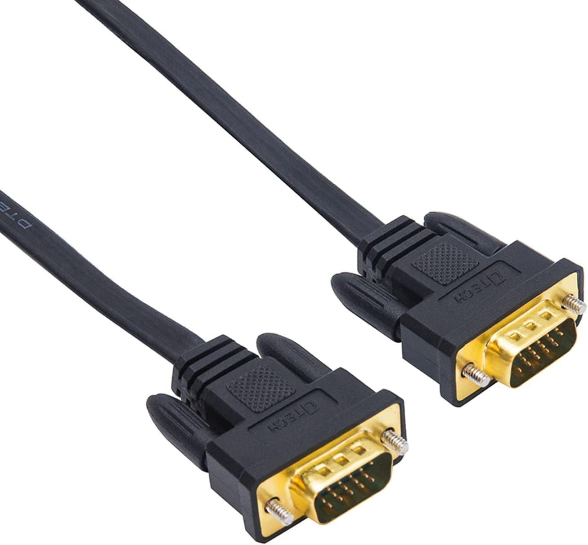
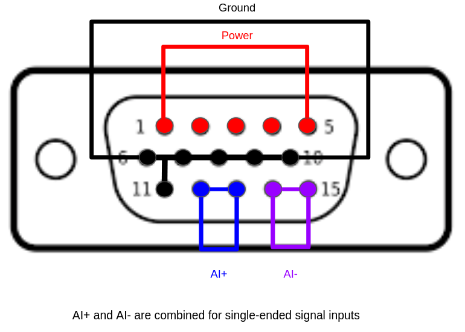
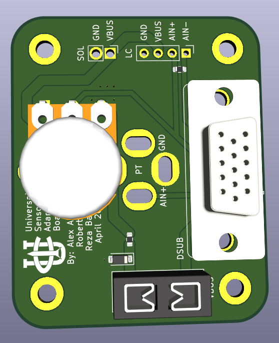
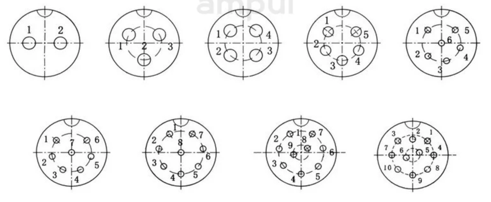

# 🔌🔌 **Standardized Connectors** 🔌🔌
In the past we used Hxchen GX connectors from Amazon. They were alright at dummy proofing connections between say, solenoids and loadcells, but were terrible to maintain. 

Since we aren't the Avionics Harnessing sub-team, we are moving to using 15 pin male to male DSUB connectors. These are easy to buy, basically just a VGA cable for monitors, and require no maintaince in-terms of assembly. All we have to do is make connector boards to mate wires between our upstream PCB and our downstream device.

  
   
  <em>Figure 1: 15 pin DSUB / VGA cable</em>

[Amazon Link](https://www.amazon.com/DTECH-Computer-Monitor-Standard-Connector/dp/B01GRJRV5Y/ref=sr_1_1_sspa?crid=3H2C6Y8PAPTPI&dib=eyJ2IjoiMSJ9.jIAKx5Z8_zT5x_0-VWRAh7-bJcD5dBD7ShJNOzLvjFZHN6WkKKUlwU39W76nSljGVMCMy0uhZgtq0smnUdwOIuBwxi0aOcZpZrSzZ8CJDhzxKoJDMPdFvXlCTh_tfIS6FGVeT9xDgCztWPe3wJl9VElE5XUC1bTLOW8onpmR0kZLJmUJvvOcXRWemlKd8s9UVxDiugmYndFwqZxM2uBht5jHdwvYFvmqU5N47XxX77g.A0kI98mUB5tWBFqRsaz7iMHTaUOyUROUR7PzBzCv_Hw&dib_tag=se&keywords=svga%2Bmale%2Bto%2Bmale%2B25%2Bft%2Bcable%2Bno%2Bfiltering%2Bshielded&nsdOptOutParam=true&qid=1773180867&sprefix=%2Caps%2C177&sr=8-1-spons&sp_csd=d2lkZ2V0TmFtZT1zcF9hdGY&th=1)

## **DSUB pinout**

  
   
  <em>Figure 2: 15 pin DSUB pinout</em>

[Edit Drawing Here](https://docs.google.com/drawings/d/1gS34vY-DHzVC5NPbUBr8_k_30yxoye9Vjk7y5DaR990/edit)

## **Universal adapter board**

  
   
  <em>Figure 2: UCIRP Universal DSUB Sensor Adapter board</em>

&nbsp;

We use this PCBA to connector our sensors to our Avionics stack

#### Inputs

| Connected to | Connector |
| :--- | :--- |
| [**(ECU v2.0)**](https://github.com/UCI-Rocket-Project/rocket2-ecu-hardware) | 15 pin, 3 row DSUB / VGA |
| [**(GSE v2.1)**](https://github.com/UCI-Rocket-Project/rocket2-gse2.0-hardware) | 15 pin, 3 row DSUB / VGA |

#### Outputs

| Output Sensor | Connector |
| :--- | :--- |
| **Pressure Transducers:** [(PT)](https://transducersdirect.com/products/pressure-transducers/standard-pressure-transducers/tdh40-pressure-transducer-low-price-high-accuracy-volume-discount/?srsltid=AfmBOoqC97pryUtSSTe17sUIVePdT9DwGcp-JyaesWPlpe1fljke151v) | 9.4 mini DIN |
| **10k Potentiometers** [(POTS)](https://www.digikey.com/en/products/detail/tt-electronics-bi/P160KNPD-4FC20B10K/2408891) | 3 pin THT |
| **Solenoids (24V)** | 2 pin THT |
| **LoadCell** [(10V, 2K lbf)](https://www.interfaceforce.com/products/interface-mini-load-cells/tension-compression-interface-mini/ssm-or-ssm2-sealed-s-type-load-cell/) | 4 pin THT |

## **Depreciated Connectors**
This is just here for documentation of our old system

HxChen GX connectors

This diagram is confusing, especially because it immediately contridicts the Hxchen GX connector, the connectors we buy from amazon pinout.
Pins 2 and 3 are backwards on the Hxchen GX connectors in comparison to the picture above.

To clear up any confusion in the future, this is the pinout.
RED: Power
YELLOW: Signal
BLACK: GND

### 24V Power
GX16 Connector \
1: +24V \
2: GND

### Battery Power
XT60 Connector \
1 (Square): +24V \
2 (Round): GND

### Solenoid
GX16 Connector \
1: +24V \
2: Control \
3: GND

### Pressure Transducer (PT)
GX12 Connector \
1: +24V \
2: Signal \
3: GND

### Thermocouple (TC)
ANSI Miniature Thermocouple Connector (K Type, Yellow) \
+: Nickel-Chromium \
-: Nickel-Alumel

### Load Cell
GX12 Connector \
1: Output- \
2: 5V \
3: GND \
4: Output+
